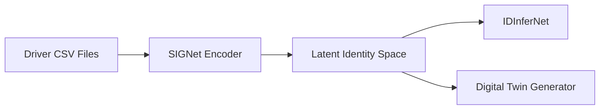

<div align="center">

# 📊 Driver-Wise Digital Twin Dataset (DD’17 Derived)
### *Federated Driver Digital Twin (FDDT) — Driver-Level Splits*


</div>

---

## 📌 Overview
This directory contains **driver-wise, experiment-ready CSV files** derived from the **DD’17 Driving Dataset**.  
Each driver is separated into **Train / Validation / Trip-wise** splits to support:

- 🚗 Driver identification
- 🧠 Digital twin modeling
- 🔐 Federated & privacy-preserving learning
- 📈 Latent behavior analysis

All files are **used directly in the FDDT experiments**.

---

## 📂 Directory Structure
```text
DT_Driver_Wise_Data/
├── Driver_B_Train.csv
├── Driver_B_Valid.csv
├── Driver_B_TripWise.csv
├── Driver_D_Train.csv
├── Driver_D_Valid.csv
├── Driver_D_TripWise.csv
├── Driver_F_Train.csv
├── Driver_F_Valid.csv
├── Driver_F_TripWise.csv
└── Readme.md
```

---

## 🧾 File Description
| File Type | Description | Purpose |
|----------|------------|---------|
| `*_Train.csv` | Driver-specific training samples | Model training |
| `*_Valid.csv` | Validation split | Hyperparameter tuning |
| `*_TripWise.csv` | Trip-level segmented data | Temporal & consistency analysis |

Each CSV contains **52 synchronized vehicular sensor signals** sampled during real-world driving.

---

## 📊 Sensor Categories (Illustrative)
- 🚘 Vehicle Dynamics (Speed, Acceleration)
- 🛞 Steering Behavior
- 🦶 Pedal Signals (Brake, Accelerator)
- 🧭 Temporal Context Signals

---

## 📈 Dataset Visual Analytics
The following plots summarize how these CSV files are used and distributed.

### 🔹 Samples per Driver


> Shows the distribution of total samples across drivers after preprocessing.

---

### 🔹 Trip-wise Distribution


> Illustrates trip-level segmentation used for temporal modeling and digital twin validation.

---

### 🔹 Driver Identity Separability (Latent Space)


> Demonstrates how driver-wise CSV files lead to highly separable latent representations.

---

## 🧪 How These CSVs Are Used in FDDT


- Raw CSVs **never leave the client device**
- Only **latent embeddings** participate in federated learning
- Synthetic data is generated from trained digital twins

---

## 🔐 Privacy Notice
⚠️ These files are derived from a real-world driving dataset.

- ✔️ Used **only for academic research**
- ✔️ No personally identifiable information (PII)
- ❌ Not for commercial or surveillance use

---

## 🔗 Original Dataset Reference
**DD’17: Driving Dataset**  
OCS Lab, HK Security

🔗 https://ocslab.hksecurity.net/Datasets/driving-dataset

```bibtex
@inproceedings{ddataset17,
  title={Know your master: Driver profiling-based anti-theft method},
  author={Kwak, Byung Il and Woo, JiYoung and Kim, Huy Kang},
  booktitle={2016 14th Annual Conference on Privacy, Security and Trust (PST)},
  pages={211--218},
  year={2016},
  organization={IEEE}
}

@misc{dd17,
  title        = {DD17: Driving Dataset},
  author       = {{OCS Lab}},
  howpublished = {https://ocslab.hksecurity.net/Datasets/driving-dataset},
  year         = {2017},
  note         = {Accessed: 2025-12-01}
}
```

---

## 📌 Notes for Reproducibility
- File names are **hard-coded** in experiment scripts
- Do not rename files unless updating configs
- CSV normalization is applied **during training**, not stored here

---

<div align="center">
<b>📊 These CSV files form the foundation of the Federated Driver Digital Twin experiments</b>
</div>


