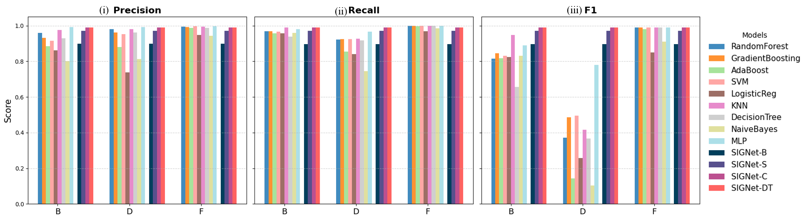
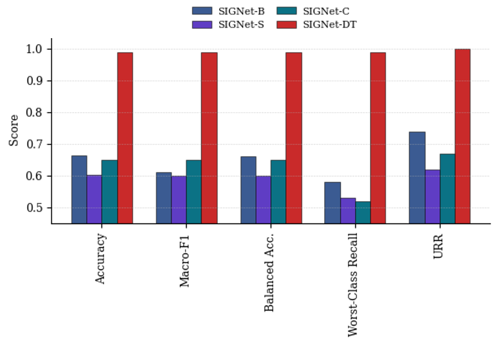
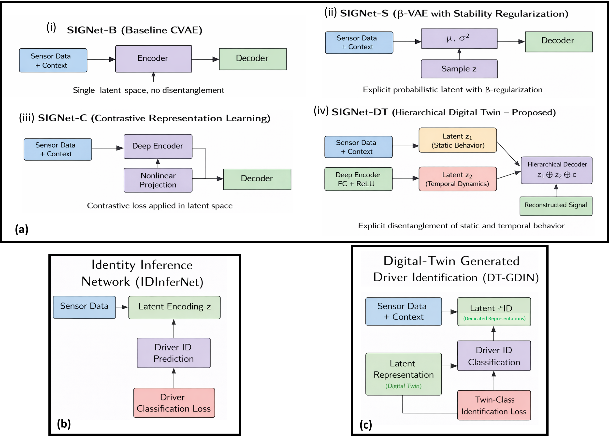
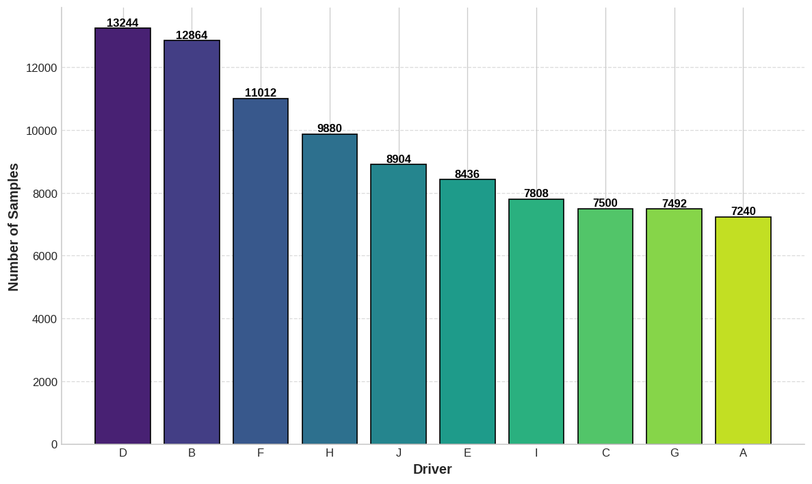
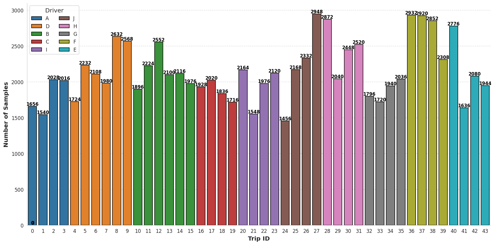
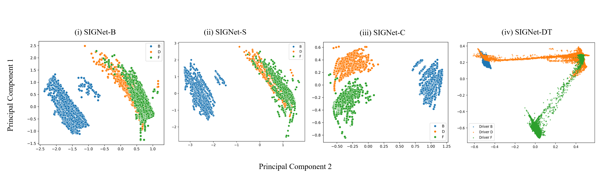
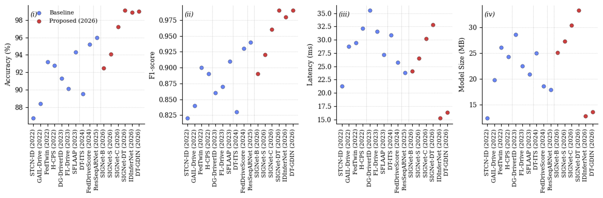
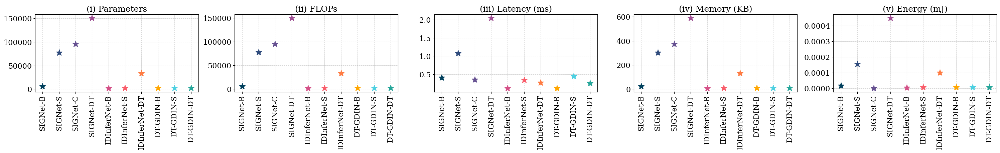

# Federated Driver Digital Twin (FDDT)

## Secure, Adaptive, and Edge-Deployable Private Models for Connected Vehicles

This repository contains the **official research artifacts, figures, and experimental results** for the paper:

> **Federated Driver Digital Twin (FDDT): Secure, Adaptive, and Edge-Deployable Private Models for Connected Vehicles**  
> *IEEE Transactions on Affective Computing*

The project introduces a **federated, privacy-preserving digital twin framework** that models driver behavior using **generative latent representations**, enabling identity-aware inference without sharing raw vehicular sensor data.

---

## 1. Repository Structure

## Repository Structure

Federated-Driver-Digital-Twin-FDDT/
Codes/
DT_Driver_Wise_Data/
Figs/
Results/
LICENSE
README.md


---

## 2. Research Motivation

Existing driver behavior modeling approaches suffer from:

- Centralized training requiring raw data sharing
- Limited privacy guarantees
- Discriminative-only pipelines without generative digital twins
- Poor scalability to edge-constrained vehicular platforms

**FDDT** addresses these challenges by learning **compact driver-specific latent digital twins** using a federated-compatible, generative architecture that preserves identity while minimizing data exposure.

---

## 3. Proposed FDDT Framework

The FDDT pipeline consists of **three modular components**:

### 3.1 SIGNet — Stochastic Identity-Conditioned Generative Network

A Conditional Variational Autoencoder (CVAE) that:
- Encodes driver behavior into compact latent digital twin states
- Preserves identity implicitly through contextual conditioning
- Supports controlled synthetic data generation

**SIGNet Variants**
- SIGNet-B: Baseline CVAE
- SIGNet-S: β-VAE with stabilized latent regularization
- SIGNet-C: Contrastive latent regularization
- **SIGNet-DT (Proposed)**: Hierarchical deployment-oriented digital twin


---

### 3.2 IDInferNet — Latent Identity Inference Network

A lightweight discriminative network that:
- Operates only on SIGNet latent embeddings
- Evaluates identity separability
- Never accesses raw sensor data



---

### 3.3 DT-GDIN — Digital-Twin Generated Driver Identification Network

A privacy-safe evaluation module that:
- Trains exclusively on DT-generated samples
- Quantifies identity consistency and utility retention
- Enables federated and synthetic benchmarking



---

## 4. Model Architectures

The architectural evolution from baseline CVAE to hierarchical digital twin is shown below:



Key properties of **SIGNet-DT**:
- Explicit disentanglement of static and temporal behavior
- Hierarchical latent structure
- Deployment-aware optimization

---

## 5. Dataset Description

Experiments use the **DD’17 Driving Dataset**, comprising:
- 52 continuous vehicular sensor signals
- 23+ hours of real-world driving
- Multiple drivers on identical routes

Driver-wise data distribution:



Trip-level statistical summary:



---

## 6. Latent Space Analysis

SIGNet-DT learns **stable and separable driver digital twin states**.



Distinct clusters confirm identity preservation and behavioral consistency.

---

## 7. Identity Inference Results (IDInferNet)

Comparison between classical ML baselines and latent DT representations:



SIGNet-DT achieves **near-perfect, balanced driver identification** without raw data access.

---

## 8. Digital Twin Generated Data Evaluation (DT-GDIN)

Synthetic data generated by SIGNet-DT retains downstream task utility:


This validates the **digital twin fidelity** of the learned latent space.

---

## 9. Edge Deployment & Efficiency

Deployment profiling under pruning and quantization:



SIGNet-DT maintains real-time inference with strong identity retention.

---

## 10. Evaluation Metrics

The framework is evaluated using **21 metrics**, including:

### Latent Metrics
- Cosine similarity
- Euclidean distance
- Fisher ratio
- Silhouette score
- Davies–Bouldin index

### Identity Metrics
- Precision, Recall, F1-score
- Worst-class recall

### Digital Twin Utility
- Balanced accuracy
- Utility Retention Ratio (URR)

### Edge Metrics
- Latency
- FLOPs
- Model size
- Energy consumption

---

## 11. Federated & Privacy Properties

| Component | Raw Data Shared | Identity Labels | Federated Suitability |
|--------|----------------|-----------------|----------------------|
| SIGNet | No | Implicit | High |
| IDInferNet | No | Local | High |
| DT-GDIN | No | Synthetic | Very High |

The architecture ensures **minimal privacy leakage** and **low communication overhead**.

---

## 12. Reproducibility

- Fixed driver-wise train/val/test splits
- Identical classifiers across experiments
- Deterministic evaluation protocol

---

## 13. License

This project is released under the **Apache License 2.0**.

---

## 14. Citation

If you use this work, please cite:

```bibtex
@article{FDDT2026,
  title={Federated Driver Digital Twin: Secure, Adaptive, and Edge Deployable Private Models for Connected Vehicles},
  author={Khan, Ajmal and Khan, Misha Urooj and Suleman, Ahmad and Kaleem, Zeeshan},
  journal={IEEE Transactions on Affective Computing},
  year={2026}
}

