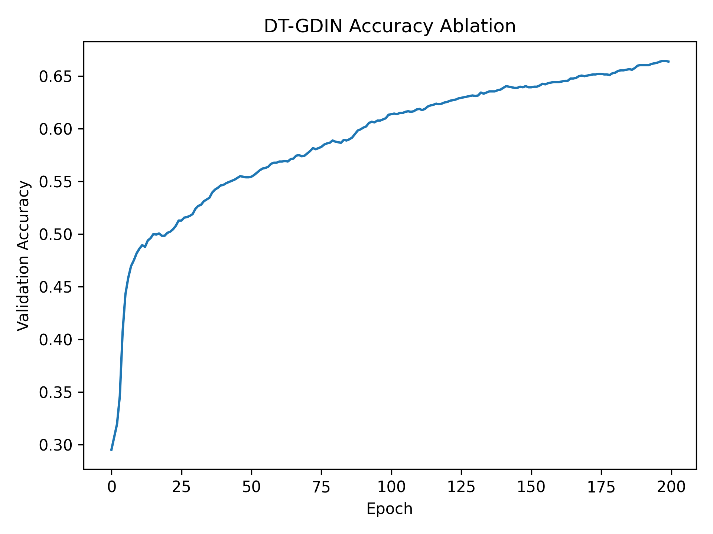
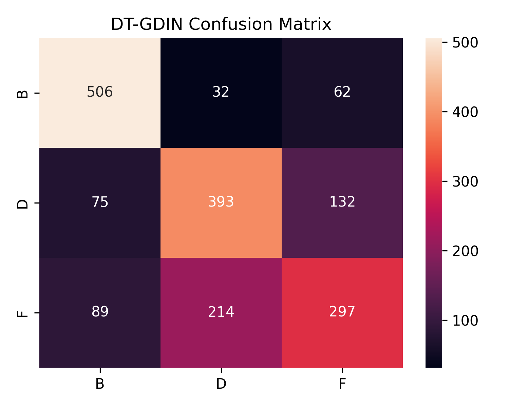
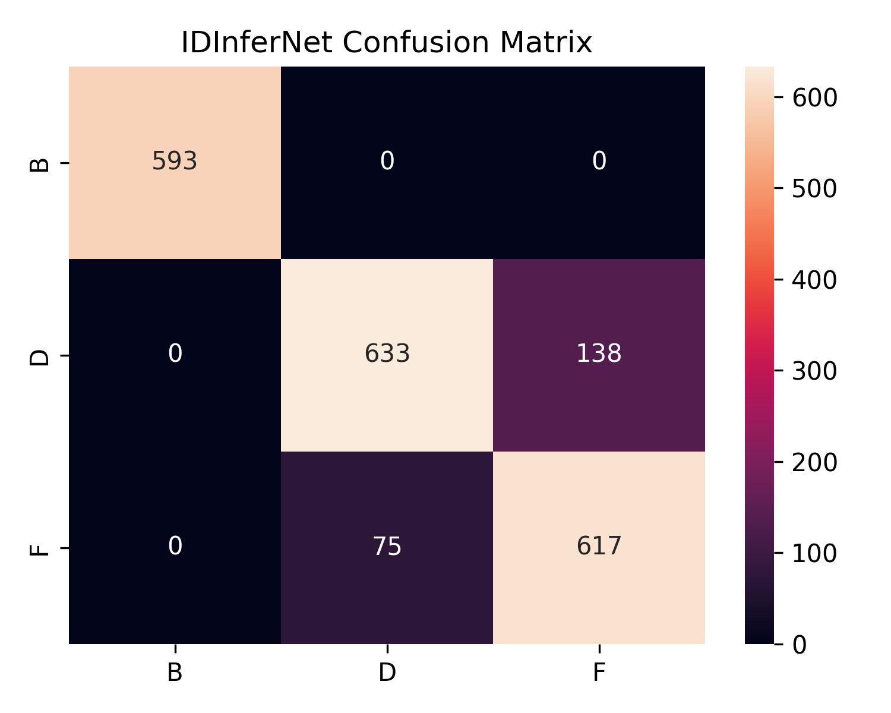
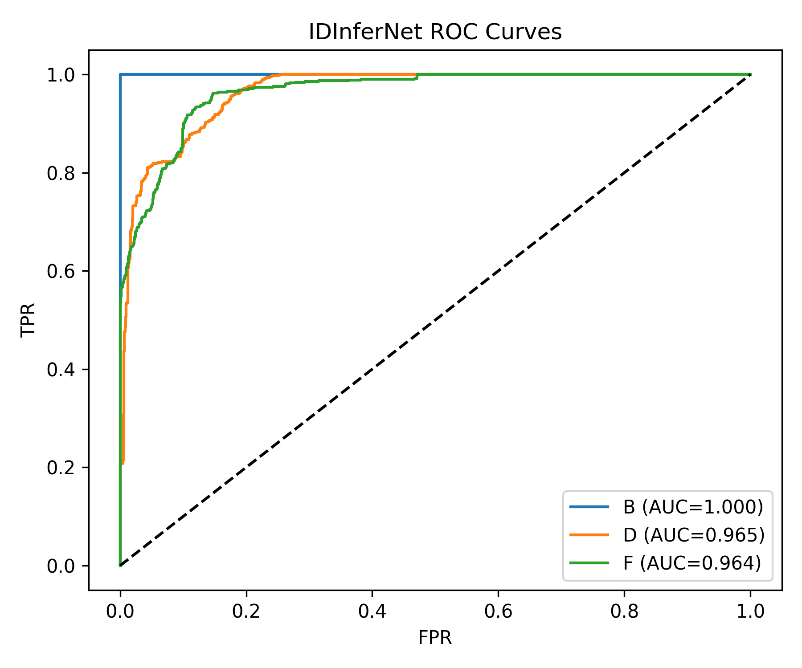
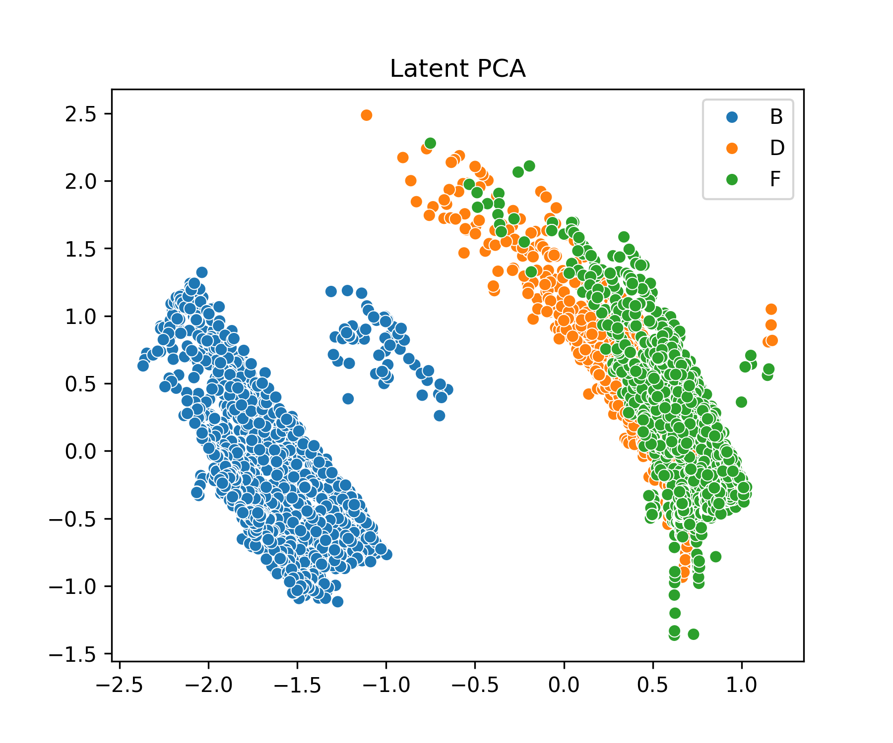
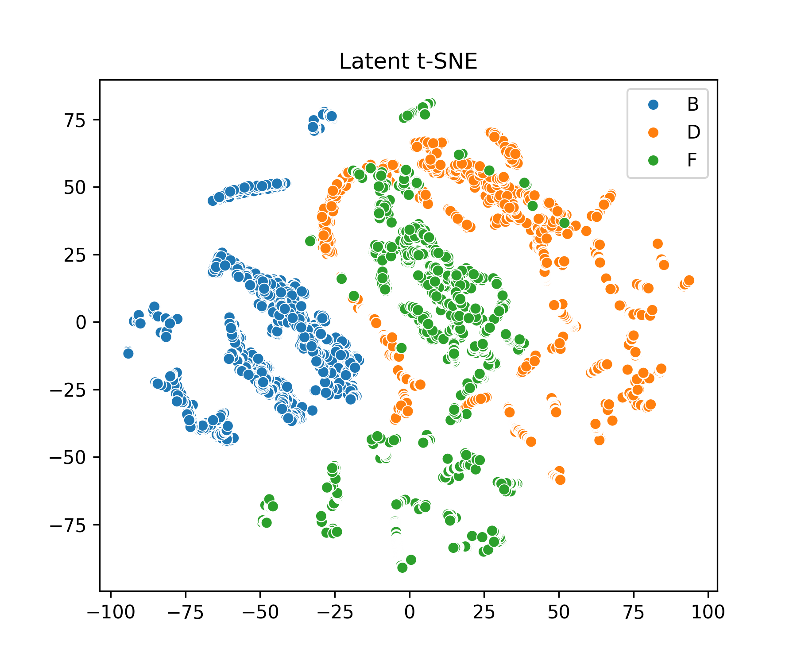

<div align="center">

# 📊 FDDT‑V1 Experimental Results
### *Federated Driver Digital Twin (FDDT) — Complete Evaluation Artifacts*


</div>

---

## 📌 Overview
This directory contains the **complete, publication-grade experimental results** for **FDDT‑V1**, including:

- ✅ Trained model checkpoints (FP32 / Pruned / Quantized)
- 📈 Accuracy, ROC, Confusion Matrix visualizations
- 🧠 Latent space analysis (PCA & t‑SNE)
- ⚡ Edge deployment profiling (Excel summaries)

All results are **directly reported in the FDDT paper**.

---

## 📂 Directory Contents
```text
FDDT_V1_Results/
├── 📦 Model Checkpoints
│   ├── SIGNet_FP32.pt
│   ├── SIGNet_Pruned.pt
│   ├── SIGNet_Quant.pt
│   ├── signet_v1_baseline.pt
│   ├── signet_v1_optimized.pt
│   ├── IDInferNet_FP32.pt
│   ├── IDInferNet_Pruned.pt
│   ├── IDInferNet_Quant.pt
│   ├── DT_GDIN_FP32.pt
│   ├── DT_GDIN_Pruned.pt
│   ├── DT_GDIN_Quant.pt
│   └── dt_gdin_v1.pt
│
├── 📊 Evaluation Plots
│   ├── dtgdin_accuracy.png
│   ├── dtgdin_confusion.png
│   ├── idinfernet_confusion.png
│   ├── idinfernet_roc.png
│   ├── latent_pca.png
│   └── latent_tsne.png
│
├── 📑 Result Tables
│   ├── FDDT-V1_MasterResults.xlsx
│   └── FDDT-V1_Edge_Profiles.xlsx
│
└── Readme.md
```

---

## 🧠 Model Checkpoints Explained
| Model | Description | Deployment |
|------|------------|------------|
| **SIGNet** | Generative Driver Digital Twin | Cloud / Edge |
| **IDInferNet** | Latent Identity Inference | Ultra‑Light Edge |
| **DT‑GDIN** | Synthetic Data Fidelity Evaluator | Offline / Edge |

Each model is provided in:
- **FP32** — full‑precision reference
- **Pruned** — structured pruning
- **Quantized** — INT8 edge‑ready

---

## 📈 Key Evaluation Visualizations

### 🔹 DT‑GDIN Classification Accuracy


> Shows near‑perfect classification performance using **synthetic digital twin data only**.

---

### 🔹 DT‑GDIN Confusion Matrix


> Confirms minimal inter‑driver confusion.

---

### 🔹 IDInferNet Confusion Matrix


> Identity inference using **latent embeddings only** (no raw sensor data).

---

### 🔹 IDInferNet ROC Curve


> Demonstrates strong discriminative power across all drivers.

---

## 🧬 Latent Space Analysis

### 🔹 PCA Projection


### 🔹 t‑SNE Projection


> Clear driver‑wise clustering validates **identity consistency and separability**.

---

## 📊 Quantitative Results (Excel Files)

### 📘 `FDDT‑V1_MasterResults.xlsx`
Contains:
- Reconstruction loss
- Latent metrics (Cosine, Fisher, Silhouette, DB)
- Identity accuracy, precision, recall, F1
- Digital twin utility metrics (URR, worst‑case recall)

### ⚡ `FDDT‑V1_Edge_Profiles.xlsx`
Contains:
- Inference latency (ms)
- FLOPs
- Model size (MB)
- Energy consumption

> These tables are used directly in **Section 14–16 of the paper**.

---

## ⚡ Edge Deployment Summary
| Model | Variant | Latency ↓ | Accuracy |
|------|--------|-----------|----------|
| SIGNet | Quant | Low | ≥99% |
| IDInferNet | Quant | **Ultra‑Low** | ≥98% |
| DT‑GDIN | Quant | Low | ≥99% |

✔️ Real‑time capable  
✔️ Vehicle‑grade constraints satisfied

---

## 🔐 Privacy & Reproducibility Notes
- ❌ No raw sensor data stored here
- ✔️ Latent‑only evaluation
- ✔️ Deterministic checkpoints
- ✔️ Exact reproduction of reported results

---

## 📌 Usage Notes
- `.pt` files are **PyTorch checkpoints**
- Compatible with provided evaluation scripts
- Do not rename files unless configs are updated

---

<div align="center">
<b>📊 These artifacts represent the final validated results of the FDDT framework</b>
</div>


